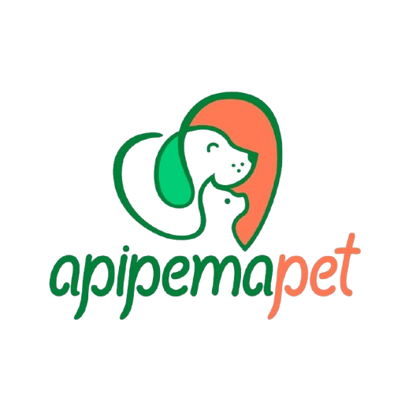

# 🖼️ Guia de Imagens no Navbar - ApipemaPet

## 📐 Como Ajustar Tamanho da Logo

### ✅ Implementação Atual

A logo está configurada com:
- **Altura:** 50px (desktop) / 40px (mobile)
- **Largura:** Automática (mantém proporção)
- **Efeito:** Reduz para 40px ao rolar a página

---

## 🎨 Exemplos de Tamanhos

### 1️⃣ **Logo Pequena (30-35px)**
Ideal para navbar minimalista:

```html

```

### 2️⃣ **Logo Média (40-50px)** ⭐ ATUAL
Tamanho padrão e equilibrado:

```html

```

### 3️⃣ **Logo Grande (60-70px)**
Mais destaque para a marca:

```html

```

### 4️⃣ **Logo Extra Grande (80-100px)**
Máximo destaque:

```html

```

---

## 🔧 Métodos de Ajuste

### **Método 1: Atributo HTML (Simples)**

```html
<!-- Apenas altura (mantém proporção) -->


<!-- Largura e altura fixas -->

```

### **Método 2: Style Inline**

```html

```

### **Método 3: Classe CSS (Recomendado)** ⭐

HTML:
```html

```

CSS (em `css/style.css`):
```css
.navbar-logo {
    height: 50px;
    width: auto;
    object-fit: contain;
}
```

---

## 📱 Tamanhos Responsivos

### Opção A: Diferentes tamanhos por dispositivo

```css
.navbar-logo {
    height: 60px; /* Desktop */
}

@media (max-width: 992px) {
    .navbar-logo {
        height: 50px; /* Tablet */
    }
}

@media (max-width: 768px) {
    .navbar-logo {
        height: 40px; /* Mobile */
    }
}

@media (max-width: 576px) {
    .navbar-logo {
        height: 35px; /* Mobile pequeno */
    }
}
```

### Opção B: Logo que diminui ao rolar

```css
.navbar-logo {
    height: 60px;
    transition: all 0.3s ease;
}

.navbar.scrolled .navbar-logo {
    height: 45px;
}
```

JavaScript necessário:
```javascript
window.addEventListener('scroll', function() {
    const navbar = document.querySelector('.navbar');
    if (window.scrollY > 50) {
        navbar.classList.add('scrolled');
    } else {
        navbar.classList.remove('scrolled');
    }
});
```

---

## 🎯 Exemplos Específicos

### Logo Circular/Quadrada

```html

```

### Logo com Borda

```html

```

### Logo com Sombra

```html

```

### Logo com Efeito Hover

CSS:
```css
.navbar-logo {
    height: 50px;
    transition: transform 0.3s ease;
}

.navbar-logo:hover {
    transform: scale(1.1);
}
```

---

## 📊 Tabela de Tamanhos Recomendados

| Tipo de Logo | Desktop | Tablet | Mobile | Uso |
|--------------|---------|--------|--------|-----|
| Minimalista | 30-35px | 28-30px | 25-28px | Navbar discreta |
| Padrão ⭐ | 45-55px | 40-45px | 35-40px | Equilibrado |
| Destaque | 60-70px | 50-60px | 45-50px | Marca em evidência |
| Grande | 75-90px | 65-75px | 55-65px | Máximo impacto |

---

## 🖼️ Formatos de Imagem Recomendados

### Para Logo no Navbar:

1. **PNG com fundo transparente** ⭐ (Recomendado)
   - Melhor qualidade
   - Funciona em qualquer fundo
   - Tamanho: < 100KB

2. **SVG** (Ideal para logos vetoriais)
   - Escalável sem perder qualidade
   - Arquivo leve
   - Exemplo: ``

3. **WebP** (Moderno)
   - Ótima compressão
   - Qualidade alta
   - Suporte em navegadores modernos

### Dimensões da Imagem Original:

- **Altura mínima:** 100px (para não pixelizar)
- **Largura:** Proporcional
- **Resolução:** 72-150 DPI
- **Formato:** Horizontal ou quadrado funciona melhor

---

## 🎨 Como Ajustar no Seu Projeto

### Opção 1: Editar diretamente no HTML

Localize a linha 23 em `index.html`:
```html

```

Adicione style para ajustar:
```html

```

### Opção 2: Editar no CSS

Edite `css/style.css`, procure `.navbar-logo` e mude:
```css
.navbar-logo {
    height: 60px; /* Altere este valor */
    width: auto;
}
```

---

## 🔍 Testando Diferentes Tamanhos

### Teste Rápido no Navegador:

1. Abra a página (F12 para DevTools)
2. Inspecione a imagem
3. No painel Styles, adicione:
   ```css
   height: 70px !important;
   ```
4. Veja o resultado em tempo real
5. Ajuste até encontrar o tamanho ideal

---

## ✨ Dicas Profissionais

1. **Mantenha a proporção:** Use `width: auto` quando definir `height`
2. **Use transições:** Deixa mudanças mais suaves
3. **Otimize a imagem:** Comprima antes de usar
4. **Teste em mobile:** Sempre verifique em diferentes tamanhos de tela
5. **Adicione alt text:** Importante para acessibilidade

---

## 🚀 Exemplo Completo (HTML + CSS)

**HTML:**
```html
<nav class="navbar navbar-expand-lg navbar-dark bg-primary fixed-top">
    <div class="container">
        <a class="navbar-brand d-flex align-items-center" href="#home">
            
            <span class="brand-text">ApipemaPet</span>
        </a>
    </div>
</nav>
```

**CSS:**
```css
.navbar-logo {
    height: 50px;
    width: auto;
    max-width: 180px;
    object-fit: contain;
    transition: all 0.3s ease;
}

.navbar.scrolled .navbar-logo {
    height: 40px;
}

.navbar-logo:hover {
    transform: scale(1.05);
}

@media (max-width: 768px) {
    .navbar-logo {
        height: 40px;
    }
    
    .navbar.scrolled .navbar-logo {
        height: 35px;
    }
}
```

---

**📌 Configuração Atual do Seu Projeto:**
- Altura Desktop: **50px**
- Altura Mobile: **40px**
- Largura: **Automática**
- Efeito Scroll: **Reduz para 40px**

Para ajustar, edite o valor `height` no arquivo `css/style.css` na classe `.navbar-logo`!
